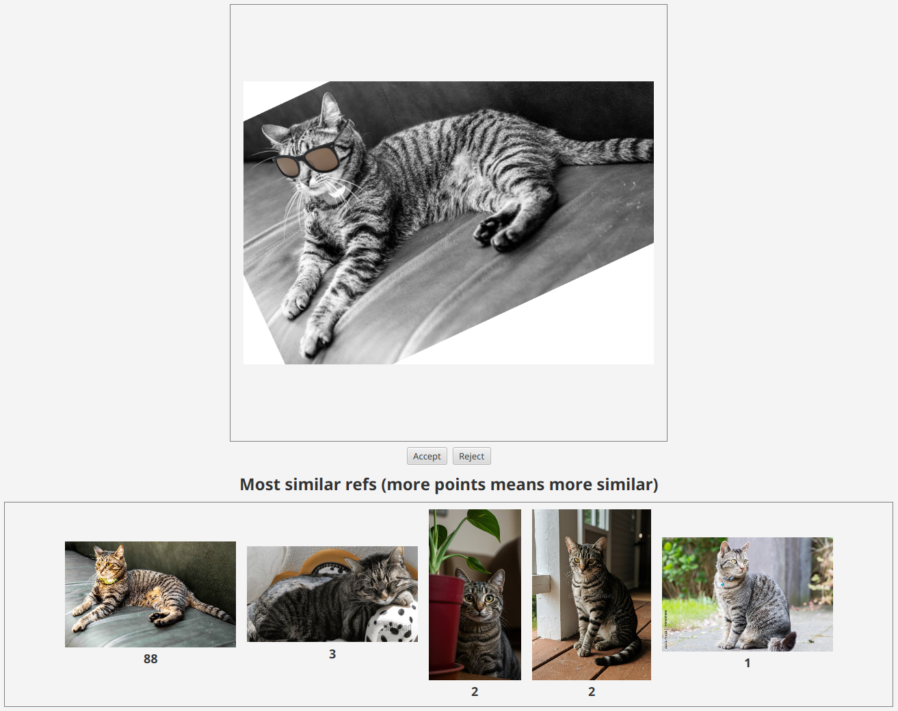
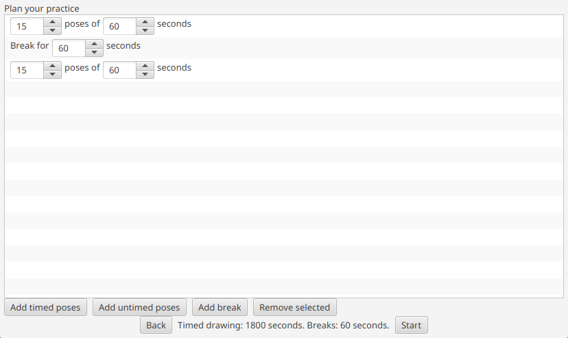
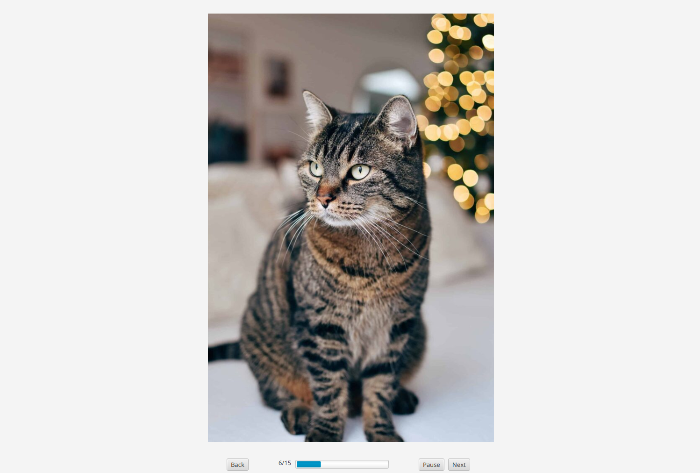

# RefLib
A feature-rich application for handling reference images throughout your artistic journey

## Features
### Store reference images while checking for duplicates
- Drag-and-drop images from the file explorer
- Using the SIFT algorithm, new reference images are checked against the references that are already stored
- Accept or reject the new reference image after checking for duplicates
- Planned: Drag-and-drop from the web
- Planned: Compare image data (like resolution) when deciding which of the duplicates to keep

### Plan practice session
- Freely plan a practice session using the stored reference images
- Timed poses: Choose the number of references and the duration of each reference
- Untimed poses: Choose the number of references
- Break: Put a break between sections of the practice session
- Planned: Filter on reference tags to limit which images are included
- Planned: Save multiple different practice sequences

### Practice session
- Randomly display references from the stored images
- Practice session goes through the steps defined during practice planning
- Remaining time and remaining reference images are always displayed
- Pause practice session
- Skip to next image

### Planned: Browse stored reference images
- Planned: Browse through all stored reference images
- Planned: Filter images based on tags

### Planned: Tags
- Planned: Filter images used in the practice session based on reference tags
- Planned: Filter images displayed when browsing based on reference tags

### Planned: Pop out reference image
- Planned: Pop out to a transparent window that can be dragged around freely
- Planned: Image controls to help compare the artwork with the reference
  - Image opacity
  - Image rotation
  - Edge detection filter (to highlight outer edges of the reference subject)

## Roadmap
### Bugs
- Upload dragboard behaves strange sometimes (at least when running from VSCode on Wayland)
  - Sometimes empty dragboard
  - Sometimes takes image in clipboard instead of dragboard
### Improvements
- Is it bad that the timer's `currentTimeProperty` is invalidated every ms?
  - Solution could be to listen for change instead of listening for invalidation
- Find a way to compute total practice time without changing `timeLabel`'s dependencies all the time
- Use the term "refs" instead of "images" and "poses"
- Avoid the dependency on libgtk-x11-2.0.so
- Look into the stack guard warning
- Be more dynamic about displayed image size
- Take metadata rotations into account
- Build guide
### Home page
- ~~Links to the other pages~~
- Stats?
### Practice page
- Ensure that terminology is consistent (e.g. practice/session, ref/pose/image)
- Provide helpful filtering options when planning practice
- ~~Display the total amount of practice time when planning practice~~
- ~~Display ref images at random~~
- ~~Show pose #~~
- Practice settings
  - Practice sequences
    - ~~Step types~~
      - ~~timed images~~
      - ~~untimed images~~
      - ~~breaks~~
    - Add a minutes field to duration
    - ~~Edit practice sequence~~
    - Save multiple different practice sequences
    - Delete a practice sequence
  - ~~Allow or disallow duplicates~~
    - ~~Restore list after each session~~
  - Filter on tags
  - Exclude NSFW
- Page to review images from session
  - ~~Show drawn images~~
  - ~~Option to copy image~~
  - Option to bulk delete
  - Option to bulk tag
  - Option to display image information
  - (Maybe) Remember previous sessions (delayed review)
- ~~Pause session~~
- ~~Skip image~~
- Mark image (for later deleting / editing / etc.)
- (Maybe) One-handed viewing tools (for the traditional people to hold the paper against the screen)
  - Quick access to filters like edge detection and threshold (easier to see ref through paper)
  - One handed transformations (zoom, rotation, panning)
- In case an image has disappeared, warn user
  - Option to remind next time RefLib is opened
- (Maybe) would it be possible to "pop out" a ref in a transparent window to let user drag ref on top of drawing program without copy-pasting? If so, add this in practice, review and browse
### Upload page
- Upload images from
  - ~~Local files~~
  - Browser
- Check new images against images in library to avoid duplicates
  - ~~SIFT~~
    - Or a faster algorithm if I ever find one that works as well
  - Store SIFT descriptors of images in library (only needs to compute descriptors for new image)
  - Handle the fact that SIFT is not flip-robust
    - Can the descriptors be flipped so they only need to be computed once?
    - Or is it necessary to compute descriptors for the image as well as the double-sided image?
  - ~~Display 5? most similar images~~
  - Let user compare and keep the image they prefer (e.g. higer res)
- Also check duplicate names I guess
### Browse page
- Browse collection based on tags
### RefLib settings
- Option to remove all mentions of "NSFW"
### Storage
- Let user define location of images
- Appdata with info about images
  - Location
  - Tags
  - SIFT descriptors
- Export database